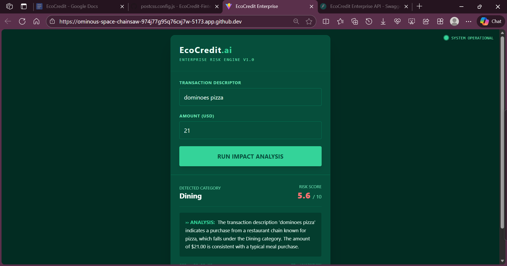

#  EcoCredit Enterprise: AI-Driven ESG Risk Engine

> **Industrial-Grade Fintech Module for Real-Time Scope 3 Emission Tracking & Credit Risk Modeling.**
> *Designed for Neobank Architectures (e.g., Tonik, Revolut).*


##  Dashboard Preview

*(The "Cyber-Eco" UI displaying real-time AI analysis of transaction data)*

---

##  The Business Case (Why this exists)
Banks are facing a massive regulatory shift: **Scope 3 Emissions Reporting**. Regulators now demand banks report the carbon footprint of the money they lend ("Financed Emissions").

Legacy systems cannot handle this because:
1.  **Data is Messy:** "STARBUCKS 404" is hard to classify.
2.  **Context is Missing:** spending $50 at a gas station could be Fuel (High Risk) or Snacks (Low Risk).
3.  **Static Rules Fail:** Hardcoded rules cannot adapt to new merchants.

**EcoCredit solves this by treating "Carbon Footprint" as a dynamic Risk Metric, similar to a Credit Score.**

---

##  System Architecture

### 1. The "Forensic" AI Agent (LangChain + OpenAI)
Instead of regex rules, we use an **Autonomous LLM Agent**.
* **Role:** Financial Analyst.
* **Logic:** It analyzes the *context* of a transaction.
* **Example:** It recognizes that a $5.50 transaction at "Shell" is likely *Groceries*, not *Fuel*, preventing false positives in the risk model.

### 2. The Dynamic Carbon Engine (Climatiq Integration)
We do not hardcode emission factors. The system connects to the **Climatiq API** to fetch scientific, region-specific emission factors (EXIOBASE data).
* **Feature:** Implements a "Dynamic Discovery" pattern that searches for the correct activity ID if the primary one is deprecated.

### 3. The Risk Scoring Model
The system generates a normalized **Green Score (0-10)**.
* **Application:** This score can be fed into a Loan Decision Engine to offer lower interest rates to eco-conscious users (tiering strategy).

---

## 🛠 Tech Stack

### Backend (The Core)
* **FastAPI (Python):** High-performance async API.
* **LangChain:** Orchestration for the AI Agent.
* **Pydantic:** Strict data validation (Industrial Standard).
* **Climatiq API:** Enterprise-grade environmental data.

### Frontend (The Interface)
* **React + Vite:** Lightning-fast rendering.
* **Tailwind CSS:** Custom "Cyber-Eco" theme designed for high-contrast visibility.
* **Axios:** Secure API communication.

---

##  Installation & Setup

### Prerequisites
* Python 3.10+
* Node.js 18+
* OpenAI API Key
* Climatiq API Key

### 1. Backend Setup
```bash
# Clone and enter repo
git clone [https://github.com/shahirun-x/EcoCredit-Fintech-Core.git](https://github.com/shahirun-x/EcoCredit-Fintech-Core.git)
cd EcoCredit-Fintech-Core

# Install Python dependencies
pip install -r requirements.txt

# Setup Environment Variables
# Create a .env file and add:
# OPENAI_API_KEY=sk-...
# CLIMATIQ_API_KEY=...

# Run the API
uvicorn app.main:app --reload

### 2. Frontend Setup
```bash

cd frontend
npm install
npm run dev

### API Documentation
The system exposes a Swagger UI at /docs.

Endpoint: POST /api/v1/analyze Payload:

JSON

{
  "description": "UBER *TRIP 882",
  "amount": 14.50,
  "currency": "USD"
}
Response:

JSON

{
  "category": "Travel",
  "reasoning": "Transaction detected as ride-sharing service...",
  "carbon_kg": 4.2,
  "green_score": 9.1
}
